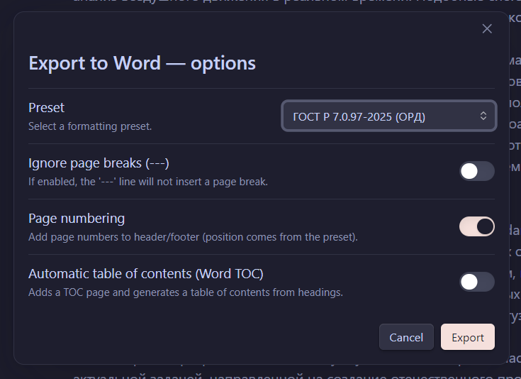

# Word Template Exporter for Obsidian

> Export Obsidian notes to **Microsoft Word (.docx)** using **powerful, customizable templates** — from academic standards to fully custom document styles.

**Word Template Exporter** is an Obsidian plugin that converts Markdown notes into professionally formatted Word documents using **template-based formatting rules**, not hardcoded styles.

The plugin is designed for:

* academic writing
* technical documentation
* reports, theses, and articles
* structured documents with strict formatting requirements

---

## ✨ Key Features

* 📄 **Export to DOCX** (Microsoft Word compatible)
* 🧩 **Template-based formatting** (presets, not hardcoded rules)
* 🎨 **Visual template editor** + raw JSON editor
* 🔁 **Instant sync** between visual editor and JSON
* 🌍 **Multilingual UI** (auto-detected from Obsidian)
* 📚 **Built-in academic standards**

    * APA 7
    * IEEE
    * GOST (Russian standards)
* 📐 Fine-grained control over:

    * fonts and font sizes
    * paragraph spacing
    * alignment and indents
    * headings hierarchy
    * tables, captions, figures
    * page margins and pagination
* 📑 Optional **automatic Table of Contents** (Word TOC)
* ⚡ Fast export with a single command

> **Note**
> Built-in templates are provided as ready-to-use presets and can be freely customized.

---

## 🧠 How It Works

1. You write notes in **plain Markdown** inside Obsidian
2. The plugin parses the document into a structured internal model
3. A **template (preset)** defines how each block type should look in Word
4. The document is exported to `.docx` using these rules

This approach avoids:

* fragile Markdown → Word conversions
* manual post-editing in Word
* duplicated styles across documents

---

## 🖼 Screenshots

> *(Screenshots will be added here)*

### Export options modal



### Visual template editor


> Visual ↔ JSON synchronization

---

## 📦 Installation

### Manual installation (from GitHub)

1. Download the repository:

   ```
   https://github.com/LekasNet/obsidian-word-template-exporter
   ```
2. Rename the plugin folder to:

   ```
   word-template-exporter
   ```
3. Copy the folder into your Obsidian vault:

   ```
   <vault>/.obsidian/plugins/word-template-exporter
   ```
4. Restart Obsidian
5. Enable **Word Template Exporter** in
   **Settings → Community Plugins**

---

## 🚀 Usage

### Fast Export

* Command:

  ```
  Export note to Word — Fast
  ```
* Uses the default template and export settings

### Advanced Export

* Command:

  ```
  Export note to Word — Advanced…
  ```
* Allows configuration of:

    * template (preset)
    * page numbering
    * table of contents
    * page break handling

---

## 🧩 Templates (Presets)

A **template** defines how each document block is formatted:

* Headings (H1–H6)
* Body text
* Tables (text, headers, captions)
* Figures and captions
* Code listings

Templates can be:

* edited visually
* edited as JSON
* imported/exported
* reused across projects

---

## 📚 Built-in Standards & Templates

Word Template Exporter includes several **built-in formatting standards**, covering both **international** and **region-specific** academic requirements.

These templates are provided as **ready-to-use presets** and can also serve as a base for custom templates.

---

### 🌍 International Standards

#### APA 7

A template based on the **APA 7th edition** guidelines, commonly used for:

* academic papers
* research articles
* theses and dissertations

The preset follows standard APA formatting rules for:

* headings hierarchy
* paragraph spacing
* fonts and alignment
* page layout

#### IEEE

A template inspired by **IEEE** document formatting, suitable for:

* technical papers
* engineering reports
* conference submissions

The IEEE preset focuses on:

* compact layout
* strict hierarchy
* technical readability

---

### 🇷🇺 Russian Standards (GOST)

In addition to international formats, the plugin includes **built-in GOST-based templates**, widely used in Russian academic and official documentation.

#### GOST R 7.0.97–2025

A template based on **GOST R 7.0.97–2025**, commonly used for:

* official documents
* reports
* formal academic texts

This preset reflects:

* page margins
* paragraph indents
* heading formatting
* spacing rules

---

### 🎓 MIREA GOST (Why “MIREA”?)

One of the built-in presets is named **MIREA**, and this is intentional.

This template is based on **GOST R 7.0.91–2021**, which is **commonly required for theses and graduation papers at MIREA** (and many other Russian universities with similar internal guidelines).

Why this preset exists:

* the author of the plugin is a **MIREA student**
* this standard is actively used in real academic work
* university requirements often **extend or slightly modify GOST**, and this preset reflects those practical constraints

What this means for users:

* you get a **battle-tested academic template**
* even if you are not a MIREA student, the preset can be:

    * used as-is
    * adapted for another university
    * copied as a base for your own standard

> The name **“MIREA”** does not lock the template to a single university —
> it simply reflects its origin and real-world usage.

---

## 🎨 Visual Template Editor

The visual editor allows you to:

* add blocks in **any order**
* choose a block type from a dropdown
* automatically reorder blocks logically
* edit formatting without touching JSON

Every visual change:

* instantly updates the JSON
* stays in sync when switching tabs

This makes template creation:

* intuitive for non-programmers
* powerful for advanced users

---

## 🌍 Localization

* UI language is **automatically detected** from Obsidian
* Supported:

    * English (`en`)
    * Russian (`ru`)
* Fallback order:

    * Obsidian language
    * system language
    * English

Document language is controlled by the **template**, not the UI.

---

## 🛠 Technical Notes

* Written in JavaScript (no TypeScript)
* Uses `docx` for Word generation
* Internal structured document model
* No external services — fully local

---

## 🗺 Roadmap

* More built-in academic templates
* Template sharing
* Improved image handling
* Section-based templates
* Metadata-driven exports

---

## 🤝 Contributing

Issues, feature requests, and pull requests are welcome.

If you:

* write academic papers
* work with strict formatting standards
* export documents to Word regularly

— your feedback is especially valuable.

---

## 📄 License

MIT
